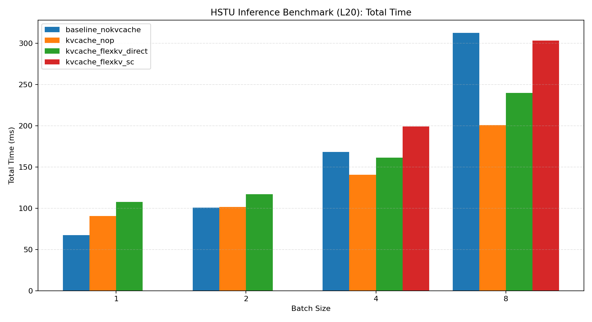
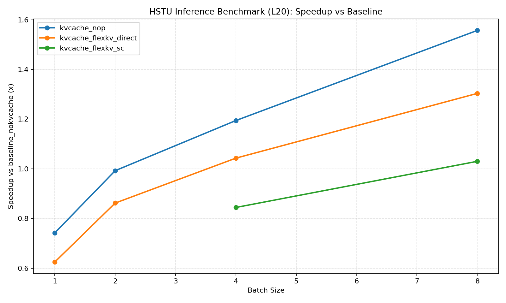
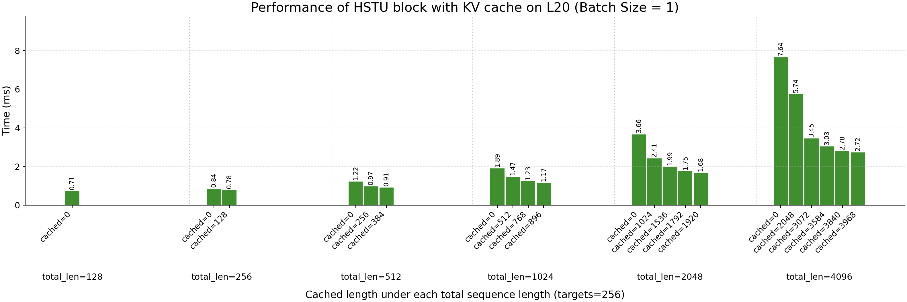
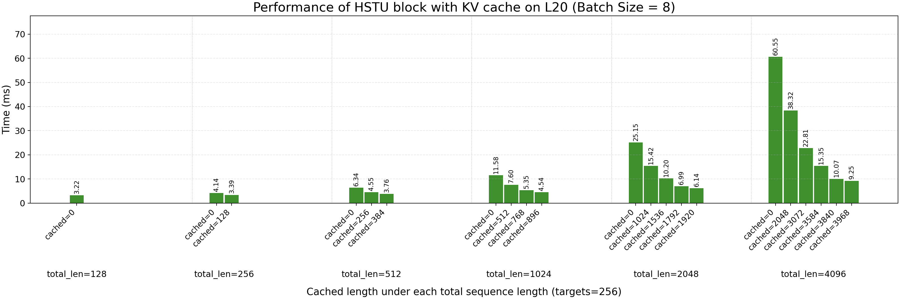
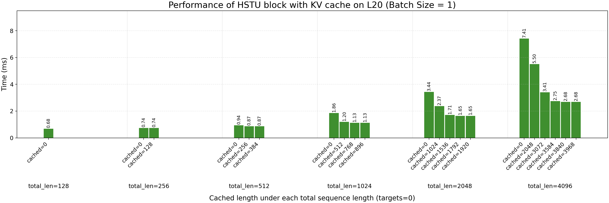
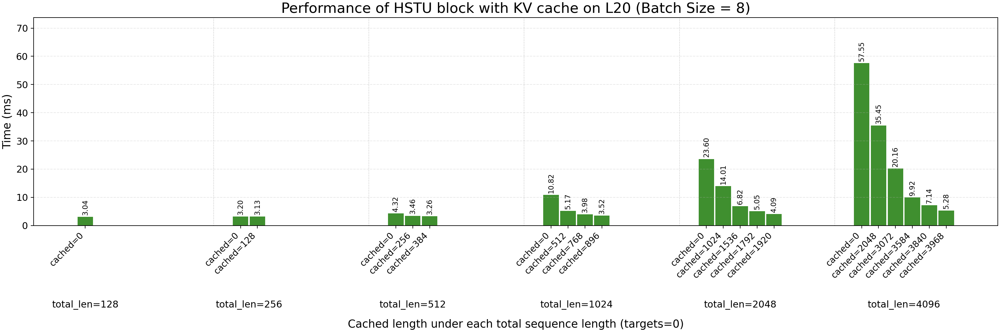

# HSTU Inference Benchmark (FlexKV Integration)

This directory tracks benchmark results for the real FlexKV integration branch.

## How to run

```bash
cd recsys-examples/examples/hstu
export PYTHONPATH=${PYTHONPATH}:$(realpath ../)
export HSTU_INFERENCE_ONLY=1
```

### 1) End-to-end benchmark

```bash
# baseline (without kvcache) / kvcache_nop / flexkv_direct / flexkv_sc are run separately.
python3 ./inference/benchmark/inference_benchmark.py ...
```

Then generate plots:

```bash
python3 ./inference/benchmark/benchmark_with_FlexKV/script/plot_benchmark_results.py \
  --log_dir ./inference/benchmark/benchmark_with_FlexKV/L20 \
  --out_dir ./inference/benchmark/benchmark_with_FlexKV/plot \
  --prefix l20
```

### 2) Paged HSTU block benchmark

```bash
# nop
python3 ./inference/benchmark/paged_hstu_with_kvcache_benchmark.py \
  --secondary_backend nop

# flexkv direct
python3 ./inference/benchmark/paged_hstu_with_kvcache_benchmark.py \
  --secondary_backend flexkv \
  --flexkv_mode direct
```

Then generate grouped bar figures:

```bash
cd ./inference/benchmark/benchmark_with_FlexKV
mkdir -p plot

for backend in nop flexkv_direct; do
  log_file="./L20/paged_hstu_with_kvcache_${backend}_targets0_256.log"
  for tgt in 0 256; do
    python3 ./script/plot_paged_hstu_grouped.py \
      --log_file "$log_file" \
      --out_dir . \
      --targets "$tgt"
    mv ./hstu_inference_l20_batch1.png "./plot/hstu_inference_l20_batch1_${backend}_targets${tgt}.png"
    mv ./hstu_inference_l20_batch8.png "./plot/hstu_inference_l20_batch8_${backend}_targets${tgt}.png"
  done
done
```

---

## Benchmark setup (L20)

| Parameter | Value |
| --- | --- |
| Number of HSTU layers | 8 |
| Hidden dim size | 1024 |
| Number of heads | 4 |
| Head dim size | 256 |
| Max batch size | 16 |
| Max per-sequence length | 4096 |
| Per-sequence targets | 256 |


## 1. End-to-end inference performance (L20)

Plot:




Measured summary (`plot/l20_summary.csv`):

| Mode | bs=1 | bs=2 | bs=4 | bs=8 |
| --- | ---: | ---: | ---: | ---: |
| baseline_nokvcache (ms) | 67.25 | 100.83 | 168.14 | 312.65 |
| kvcache_nop (ms) | 90.62 | 101.61 | 140.79 | 200.79 |
| kvcache_flexkv_direct (ms) | 107.63 | 116.98 | 161.23 | 239.84 |
| kvcache_flexkv_sc (ms) | - | - | 199.15 | 303.52 |

Speedup vs baseline (`baseline_time / mode_time`):

- `kvcache_nop`: **0.74x ~ 1.56x**
- `kvcache_flexkv_direct`: **0.62x ~ 1.30x**
- `kvcache_flexkv_sc` (bs=4/8): **0.84x ~ 1.03x**

Observation:

- Throughput benefit appears mainly at larger batch sizes.
- Small-batch end-to-end latency regresses with current FlexKV integration path.
- `server_client` currently adds additional overhead vs `direct`.

## 2. HSTU block performance (paged benchmark, L20)

Compared logs:

- `L20/paged_hstu_with_kvcache_nop_targets0_256.log` (nop, targets in `{0, 256}`)
- `L20/paged_hstu_with_kvcache_flexkv_direct_targets0_256.log` (flexkv direct, targets in `{0, 256}`)

Representative plots (targets=256):


*Backend = Nop*

*Backend = Flexkv*

*Backend = Nop*

*Backend = FlexKV*

Representative plots (targets=0):


*Backend = Nop*

*Backend = FlexKV*

*Backend = Nop*

*Backend = FlexKV*

Quantitative summary for `total_len=4096`:

- **`nop_time / flexkv_direct_time` is ~1.0** in all four slices:
  - `batch=1, targets=0`: min/max/avg = `0.9997 / 1.0018 / 1.0005`
  - `batch=1, targets=256`: min/max/avg = `0.9993 / 1.0019 / 1.0004`
  - `batch=8, targets=0`: min/max/avg = `0.9995 / 1.0010 / 1.0001`
  - `batch=8, targets=256`: min/max/avg = `0.9994 / 1.0011 / 1.0001`

Intra-run cache benefit (`cached=3968` vs `cached=0`, same backend):

- `batch=1, targets=0`: ~`2.76x`
- `batch=1, targets=256`: ~`2.81x`
- `batch=8, targets=0`: ~`10.91x`
- `batch=8, targets=256`: ~`6.54x`

Observation:

- Paged HSTU block compute remains effectively unchanged between `nop` and `flexkv_direct`.
- The main performance gap in this branch is not in the paged block kernel itself; it likely comes from end-to-end pipeline overheads.

## 3. B200 status

B200 benchmark numbers are not refreshed in this README yet.
Current Blackwell issues and candidate fixes are tracked in:

- `balckwell_bug.md`